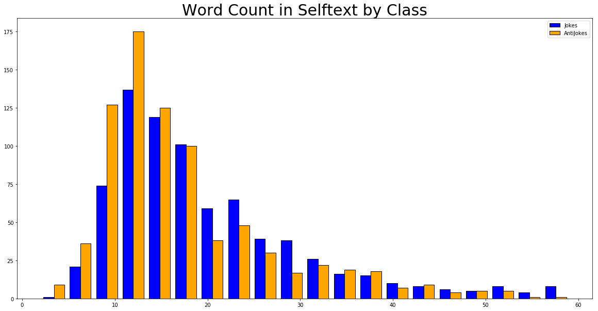

# Project 3: Reddit API and Natural Language Processing

_Browsing Reddit.com/r/Jokes during work is not recommended_

### Background Information
According to Wikipedia, "Reddit is an American social news aggregation, web content rating, and discussion website. Registered members submit content to the site such as links, text posts, and images, which are then voted up or down by other members. Posts are organized by subject into user-created boards called "subreddits", which cover a variety of topics including news, science, movies, video games, music, books, fitness, food, and image-sharing."

As a social news aggregation and discussion website, Reddit is a trove of information and data on a plethora of subjects, grouped in what are called "subreddits." Analyzing the content of those subreddits can provide invaluable insight.

Furthermore, according to Wikipedia, "Natural language processing (NLP) is a subfield of computer science, information engineering, and artificial intelligence concerned with the interactions between computers and human (natural) languages, in particular how to program computers to process and analyze large amounts of natural language data."

Natural Language Processing is extremely important in the endeavor to make computers understand the human language. And perhaps the most difficult and convoluted application of the human language is humor. Although there are many kinds of comedy that can be analyzed with Natural Language Processing, sarcastic humor is an especially difficult kind of humor to understand. Thus, this project will be dedicated to using NLP techniques to analyze two subreddits, **/r/Jokes** and **/r/AntiJokes**, in the name of tackling humor.

### Goal
The goal of this project is to use the Reddit API to extract and analyze the text from two subreddits and, using a variety of NLP and classification techniques, determine if a model can accurately predict what subreddit a post is from. Furthermore, a more lofty goal for this project is to get a glimpse into how machine learning applies itself to humor. The Data Science Problem that I will be tackling through the project is **"Using NLP and Classification techniques, can I create a model that predicts that a post belongs to the /r/AntiJokes subreddit correctly with greater accuracy than the baseline of 50%? Can I find some signal within text belonging to Jokes and AntiJokes that can allow machine learning to differentiate between the two?"**

### Project Outline
1. Using the Reddit API, create a script that will extract thousands of data observations (posts) from the /r/Jokes and the /r/AntiJokes subreddits
2. Clean the extracted data
3. Use Natural Language Processing techniques (tokenizing, lemmatizing, vectorizing by count and term-frequency-inverse-document-frequency) to preprocess the data and do exploratory data analysis
4. Use Latent Semantic Analysis to understand the relationship drawn between words by machine learning
5. Create classification models that will accurately predict which subreddit a post is from, specifically using Random Forests and Gradient Boosting classifiers.
6. Evaluate performance of models and answer the problem statement

### Data Dictionary
|**Feature**|**Type**|**Description**|
|---|---|---|
|Subreddit | int |  0 for /r/Jokes and 1 for /r/AntiJokes |
|title | str | Text from the title of the subreddit post|
|selftext | str | Text from the body of the subreddit post (the content; the Reddit API refers to this as the 'selftext'|
|joined | str | Joined text from the title and the selftext of the subreddit post|
|word_count | int | Word count of the 'joined' string|

### Repository Structure
**Folders**
- data : Data files created and needed for project.
- images : Image files that either have been produced by the project for presentation or other images added to presentation.

**Notebooks**  
There are 10 notebooks, each of them serving one or more of the following purposes:
- Tutorial notebook to become acclimated with the Reddit API
- Scraping notebook to extract data from Reddit into 'jokes.csv' and 'antijokes.csv'
- Exploratory Data Analysis notebooks to clean, preprocess (tokenize, lemmatize, vectorize) and do basic EDA on the title, selftext, and both.
- Latent Semantic Analysis notebook to apply LSA and SVD on the 'joined' text, as well as applying a preliminary KNN classification model
- Modeling notebooks (one for Random Forests and one for Gradient Boosting)

**Other Files**
- Presentation.pdf: Presentation for Non-Technical Audience

### Executive Summary
>Joke: Why did the monsters change a lightbulb?
>

Answer!
And a cow the cough.
  

The above joke is one that was artificially created by a machine learning algorithm (trained by Janelle Shane ([Link](http://aiweirdness.com/post/174691534037/why-did-the-neural-network-cross-the-road))) and makes no sense whatsoever. Perhaps it caused you to chuckle, but not because the joke itself was inherently funny (maybe because the algorithm put together nonsensical words that seemed strange!). We rely on machine learning to optimize models, visualize graphs, calculate complex equations all in the blink of an eye. Why can't a computer learn how to make us laugh, let alone learn how to communicate in the human language?

The internet is built on the interactions and communication that humans have with each other. Countless sites are discussion boards where people can gather and converse on any topic they want. Perhaps there is no other well-known website for this purpose than Reddit.com. Reddit is, essentially, a large discussion board where people can go to share and gain knowledge. The website is divided into different topics called "subreddits". For example, one can find the latest conglomerate of cute dog and cat pictures on . Not only this, but the information on the website is quite easily gathered through the API (application program interface) that is provided by Reddit.

Of the many subreddits available, there are quite a few that are centered on humor and jokes. One of them is /r/Jokes, where jokes are constantly being updated everyday so you can get a good laugh. Another subreddit is /r/AntiJokes. AntiJokes are "a type of indirect humor that involves the joke-teller delivering something which is intentionally not funny, or lacking in intrinsic meaning" (Wikipedia). Thus, there is a sarcastic twist to this kind of humor.

I chose these two subreddits to guide my project in NLP. My goal in the project was to take these two subreddits, analyze their posts using NLP techniques, and create a model that can predict whether or not a post is from one of the two subreddits. My problem statement was **"Using NLP and Classification techniques, can I create a model that predicts that a post belongs in to the /r/AntiJokes subreddit correctly with greater accuracy than the baseline of 50%? Can I find some signal within text belonging to Jokes and AntiJokes that can allow machine learning to differentiate between the two?"**

For this purpose, I extracted 5000+ posts from each subreddit (for a total of a little more than 10000 posts), with each post including its subreddit, title, selftext (content of the post), author name, number of comments, number of likes, and the permalink. My target variable that I tried to predict was the actual subreddit.

I used a variety of NLP techniques to clean and preprocess the data. I used Regular Expression (RegEx) to clean the posts, tokenized and lemmatized each post, vectorized each post by count and term-frequency-inverse-document-frequency (TFIDF). 

Furthermore, I used Latent Semantic Analysis on the text data for two reasons. One, to see the relationship of principal components (or "topics") that the algorithm would produce. And two, for the purpose of dimensionality reduction.

With the cleaned and preprocessed data, I used three models to try to predict the correct class (1 for /r/AntiJokes and 0 for /r/Jokes): k-Nearest Neighbors, Random Forests, and Gradient Boosting. Before modeling, I established my baseline accuracy as 50% (since this was the distribution of the classes of the data). With KNN, I achieved a new baseline accuracy of about 59% (which was a little better). Using Random Forests, I upped the baseline accuracy to 64%. Lastly, the highest accuracy score I achieved was with Gradient Boosting at 65%. Even with numerous tweaking of hyperparameters, I was unable to achieve a higher accuracy score than 65%.

Admittedly, this was not as high a score that I wanted to achieve. However, I realize that finding the subtle difference between a Joke and an AntiJoke is something that even we as humans have difficulty explaining or understanding at times. The 65% accuracy score tells me that there is definitely some signal that machine learning is picking up, which is a hopeful sign for future endeavors. Future steps would be to become more well-versed in the academic literature concerning AI and humor, as well as looking more deeply into NLP as a whole.

According to the article on the Neural Joking Machine, "Laughter is a special, higher-order function that only humans possess". Perhaps we are still years, if not decades, away from AI-generated humor, let alone AI understanding humor. Perhaps we will never get there, if humor truly is an aspect unique to us humans.

### Further Reading Materials (some for the laughs!)
- [Why did the neural network cross the road](http://aiweirdness.com/post/174691534037/why-did-the-neural-network-cross-the-road)
- [Joke-Telling Robots Are the Final frontier of Artificial Intelligence](https://motherboard.vice.com/en_us/article/z43nke/joke-telling-robots-are-the-final-frontier-of-artificial-intelligence)
- [It's Hard Work Being Funny - Especially for Robots](https://splinternews.com/its-hard-work-being-funny-especially-for-robots-1793853950)
- [Neural Joking Machine: Humorous Image Captioning](https://arxiv.org/pdf/1805.11850.pdf)
- [Will AI ever be able to make a joke?](https://medium.com/@davidolarinoye/will-ai-ever-be-able-to-make-a-joke-808a656b53a6)
- [Can Artificial Intelligence Understand Humor?](https://www.finchannel.com/technology/75058-can-artificial-intelligence-understand-humor)
